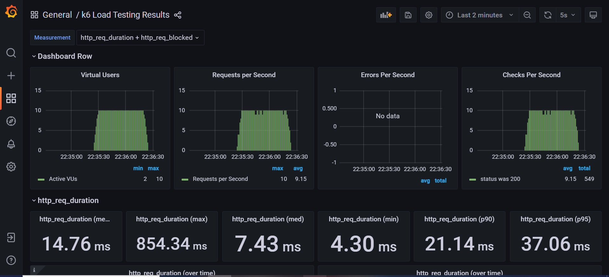

# IMD Load Test
This repository addresses a proof of concept about load test in a docker environment for educational purposes at IMD.

1) There is a 10 seconds ramp-up of requests;
2) 50 seconds of requests with maximum VU's (virtual users);
3) Finishing with a 10 seconds ramp-down.

## Tech stack
- Nginx;
- .NET 8;
- MySQL;
- Docker;
- K6;
- Grafana;
- InfluxDB

## How to get service up and running
```
./run.sh up
```

## How to start load test
```
./run.sh loadtest
```

## How to clean up
```
./run.sh down
```

# Results
- Execution of load test in k6;
- Automatic real time report of load test in grafana via influxdb;
- Metrics collected such as median response time.


